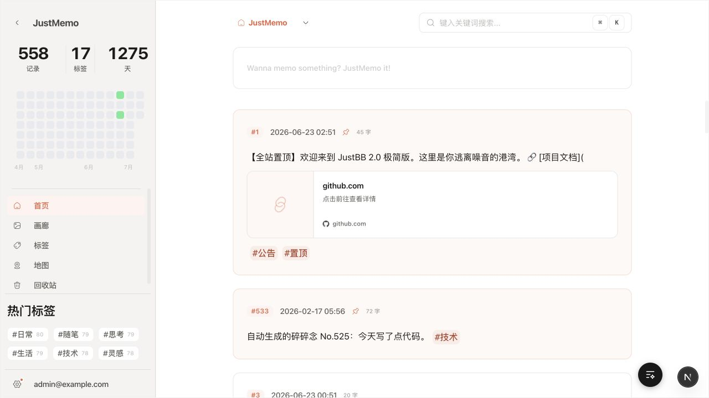

<p align="center">
  
</p>

<h1 align="center">JustMemo</h1>

<p align="center">
  一个安静的私人记忆容器，用来保存想法、情绪、照片、足迹和时间。
</p>

<p align="center">
  <a href="./docs/reference/privacy-and-data.md">隐私模型</a>
  ·
  <a href="./docs/reference/product.md">产品能力</a>
  ·
  <a href="./docs/reference/architecture.md">架构参考</a>
  ·
  <a href="./docs/reference/development.md">开发文档</a>
</p>

<p align="center">
  
</p>

## 这是什么

JustMemo 是一个基于 Next.js、React、TypeScript 和 Supabase 构建的私密 Memo 系统。它不是公开社交产品，也不是团队知识库，而是一个长期个人记录空间：公开内容可以自然展示，私密内容按条加锁，访客只有输入该条 Memo 的口令后，才能在当前页面会话中临时解锁。

这个项目的核心判断很简单：存在感可以被看见，正文不能被越权读取。列表、地图、时间轴和画廊可以展示锁定占位；搜索、标签聚合、导出、分享和统计不能消费未解锁正文。

## 亮点

- **单条私密解锁**，解锁状态只存在于当前页面内存，不写入 Cookie、`localStorage` 或 URL。
- **时间轴与热力图**，用日期、年份和月份回到某一段记录。
- **地图记忆**，带坐标的 Memo 会落到地图上，私密内容只显示锁定标记。
- **图片画廊**，聚合包含图片的 Memo，未解锁私密图片使用安全占位。
- **作者导出**，只导出当前作者自己的 Memo。
- **数据库兜底**，RLS、RPC 和数据库约束才是权限真相。

## CLI

JustMemo 提供独立的终端客户端，浏览器只负责设备授权，日常操作仍在 terminal 中完成：

```bash
npm install -g justmemo-cli
justmemo login
justmemo search 旅行
justmemo show 123
justmemo publish 今天的记录
justmemo edit 123
justmemo trash
```

CLI 支持登录、退出登录、查看当前用户、发布、搜索、查看、编辑、置顶、公开/私密切换和回收站管理；访客可临时解锁单条私密 Memo。授权页面位于 `/cli/authorize`，授权码不会写入 URL，也不会要求在终端输入密码。

详细命令说明见 [`cli/README.md`](./cli/README.md)，系统架构和隐私边界见 [`docs/reference/`](./docs/reference/)。

## 技术栈

| 层级   | 技术                                         |
| ------ | -------------------------------------------- |
| 应用   | Next.js 16、React 19、TypeScript             |
| UI     | Tailwind CSS 4、Framer Motion、Hugeicons     |
| 编辑器 | Tiptap 3                                     |
| 地图   | Leaflet、react-leaflet                       |
| 后端   | Supabase Auth、Postgres、RLS、RPC、Storage   |
| 测试   | Vitest、React Testing Library、本地 Supabase |

## 本地启动

```bash
cp .env.example .env.local
npm install
npm run dev
```

`npm run dev` 会检查并启动本地 Supabase，然后启动 Next.js 开发服务器。需要连接远程数据库时使用：

```bash
npm run dev:remote
```

常用校验命令：

```bash
npm run test
npm run test:integration
npm run build
npm run check
```

## 项目结构

```text
src/app       App Router 页面、布局和 API route
src/server    Server Actions 与服务端集成
src/features  按业务域组织的 UI、hooks 和局部逻辑
src/shared    共享 UI、layout、hooks 和基础工具
src/state     应用级 Context
src/lib       Supabase client、环境变量校验、业务工具
supabase      本地 Supabase 配置、迁移和 seed
docs          架构、产品、数据隐私、开发和测试文档
```

## 文档

- [数据与隐私参考](./docs/reference/privacy-and-data.md)
- [产品能力参考](./docs/reference/product.md)
- [架构参考](./docs/reference/architecture.md)
- [开发参考](./docs/reference/development.md)
- [测试参考](./docs/reference/testing.md)
- [设计系统](./docs/interface/design.md)
- [Supabase 目录说明](./supabase/README.md)

## 致谢

本仓库最早基于 [daibor/nonsense.fun](https://github.com/daibor/nonsense.fun) 的思路演化而来，后续围绕私密记录、作者权限模型、地图、时间轴和内容体验做了持续重构。
