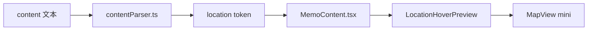
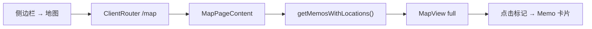
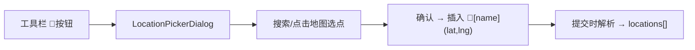

# 定位与地图功能设计文档 (Location & Map Feature)

> 最后更新：2026-02-23
> 状态：已实现，持续迭代中

---

## 1. 功能概述

为 Memo 内容新增地理位置标记能力，包含三大子功能：

1. **内容定位标记**：在编辑器中通过按钮/命令插入定位，生成 `📍[地名](lat,lng)` 语法标记
2. **悬浮地图预览**：鼠标悬浮在定位标记上，弹出小窗口显示地图标记点
3. **地图全页视图**：侧边栏新增「地图」入口，展示所有含定位的 Memo 标记点

---

## 2. 技术选型

### 2.1 地图服务：Leaflet + CartoDB Basemaps

| 维度 | 选择 | 理由 |
|:---|:---|:---|
| **地图 SDK** | [Leaflet](https://leafletjs.com/) v1.9+ | 轻量、开源、成熟生态 |
| **瓦片服务** | [CartoDB Basemaps](https://github.com/CartoDB/basemap-styles) | 零成本、无 API Key、自动跟随应用主题切换（浅色 Voyager / 深色 Dark Matter） |
| **React 封装** | 原生 Leaflet + dynamic import | 避免 SSR 问题，懒加载优化 |

> ℹ️ 原始方案使用 OpenStreetMap 默认瓦片，后升级为 CartoDB 以获得更现代的视觉风格。底图通过 `next-themes` 的 `useTheme()` 自动跟随明暗主题切换。

**安装依赖**:
```bash
npm install leaflet
npm install -D @types/leaflet
```

### 2.2 定位语法：编辑器插入 + 内联标记

**存储格式**（在 `content` 字段中）:
```
📍[东京塔](35.6586,139.7454)
```

**输入方式**：编辑器工具栏「定位」按钮 → 弹出地图选点对话框 → 搜索或点击地图选择位置 → 自动插入标记

---

## 3. 数据模型

### 3.1 memos 表扩展

新增 `locations` JSONB 字段：

```sql
ALTER TABLE memos ADD COLUMN locations JSONB DEFAULT '[]'::JSONB;
```

数据结构：
```ts
type Location = {
  name: string;   // 地名
  lat: number;    // 纬度
  lng: number;    // 经度
}

// memos.locations: Location[]
```

> 设计理由：使用 JSONB 而非独立表。与 `tags` (text[]) 设计思路一致 —— 定位与 Memo 是 1:N 弱关联，不需要独立查询索引。

### 3.2 TypeScript 类型

```ts
// types/memo.ts
interface Memo {
  // ...existing fields
  locations?: { name: string; lat: number; lng: number }[] | null;
}
```

```ts
// lib/contentParser.ts 新增 token 类型
| { type: 'location'; value: string; name: string; lat: number; lng: number }
```

---

## 4. 架构设计

### 4.1 内容解析流



### 4.2 地图页面流



### 4.3 编辑器插入流



---

## 5. 组件清单

| 组件 | 类型 | 职责 |
|:---|:---|:---|
| `MapView` | 新增 | Leaflet 地图封装，支持 mini/full 模式、自动跟随应用主题切换底图（Voyager / Dark Matter） |
| `LocationHoverPreview` | 新增 | 悬浮地图预览（Radix HoverCard） |
| `LocationPickerDialog` | 新增 | 编辑器地图选点对话框 |
| `MapPageContent` | 新增 | `/map` 全页地图视图 |
| `MemoContent` | 修改 | 新增 location token 渲染分支 |
| `LeftSidebar` | 修改 | navItems 新增「地图」菜单 |
| `ClientRouter` | 修改 | 新增 `/map` 路由 |
| `contentParser` | 修改 | 新增 location 正则解析 |

### 5.1 MapView 可配置属性

| 属性 | 类型 | 默认值 | 说明 |
|:---|:---|:---|:---|
| `markers` | `Location[]` | — | 标记点列表 |
| `mode` | `'mini' \| 'full'` | `'mini'` | 地图尺寸模式 |
| `interactive` | `boolean` | `false` | 是否允许拖拽交互 |
| `onMapClick` | `(lat, lng) => void` | — | 地图点击回调 |
| `onMarkerDragEnd` | `(lat, lng) => void` | — | 标记拖拽结束回调 |

---

## 6. Server Actions 变更

| Action | 类型 | 说明 |
|:---|:---|:---|
| `createMemo` | 修改 | Schema 新增 locations 字段，写入 DB |
| `updateMemoContent` | 修改 | 同步更新 locations |
| `getMemosWithLocations` | 新增 | 查询含定位的 Memo 列表 |

---

## 7. 文档更新清单

| 文档 | 更新内容 |
|:---|:---|
| `database-schema.md` | 新增 locations 字段说明 |
| `api-spec.md` | 新增 getMemosWithLocations 接口 |
| `roadmap.md` | 新增定位与地图功能条目 |
| `design-system.md` | 地图组件视觉规范（如圆角、阴影） |
