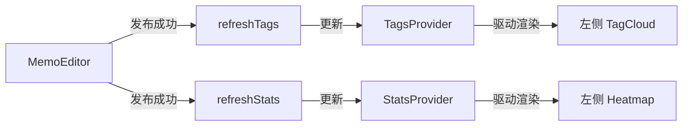

# JustMemo 业务逻辑架构 (Logic Architecture)

> **最后更新日期**：2026-02-18

本文档描述了 JustMemo 的核心业务逻辑，特别是数据加载、状态同步以及编辑器联动机制。

---

## 1. 数据加载策略 (Data Loading)

我们采用 **“服务端预拉取 (SSR) + 客户端 Context 接力”** 的模式，兼顾 SEO、首屏加载速度和交互的平滑度。

### 1.1 首屏加载全路径
1.  **用户请求**：浏览器发起 URL 请求。
2.  **服务端并行抓取**：在 `app/(main)/layout.tsx` 中，利用 `Promise.all` 并发调用 Server Actions。
    - `getAllTags()`：获取全局标签云数据。
    - `getTimelineStats()`：获取右侧时间轴归档计数。
    - `getMemoStats()`：获取热力图格点及顶栏统计（笔记数/标签数/活跃天数）。
3.  **内联注入**：服务器将抓取到的数据以 props 形式传递给 `ClientLayoutProviders`。
4.  **客户端水合 (Hydration)**：
    - 各个 Context Provider（`TagsProvider`, `StatsProvider`, `TimelineProvider`）接收 `initialData` 作为初始状态。
    - **零延迟渲染**：侧边栏组件（`TagCloud`, `Heatmap`, `Timeline`）在加载时直接从 Context 读取数据，无需在浏览器端再次发起 Fetch 请求。

### 1.2 动态同步机制 (Real-time Sync)
当数据发生变更（如发布/删除笔记）时，系统通过以下链路保证全站同步：

---

## 2. 核心状态流 (Context Map)

| Context | 管理职责 | 触发刷新的操作 |
| :--- | :--- | :--- |
| **UserContext** | 登录状态、管理员权限、登入/登出生命周期 | 登录/退出按钮 |
| **TagsContext** | 热门标签列表及其计数 | 发布、更新、物理删除笔记 |
| **StatsContext** | 热力图格点数据、笔记总数、标签总数、总天数 | 发布、更新、删除、物理删除笔记 |
| **TimelineContext** | 时间轴的高亮同步与统计 | URL 参数变更、笔记变更 |

---

## 3. 编辑器逻辑 (Editor Workflow)

`MemoEditor` 采用了 Tiptap 扩展与本地缓存相结合的设计：

1.  **本地全量索引**：`MemoCache` 在页面挂载后静默加载所有笔记的编号与内容，实现极速的 `@编号` 建议。
2.  **智能提取**：发布前自动通过正则提取 `#标签`，无需用户手动指定分类。
3.  **联动更新**：利用 `useStats` 和 `useTags` 的 Hook，在发布成功的回调里瞬间通知全站 Sidebar 更新，从而消除了手动刷新页面的需要。

---

## 4. 视觉一致性方案

全站采用 **“骨架屏优先 (Skeleton-First)”** 原则：
- 任何由于 `isLoading` 引起的等待，统一使用淡色的 Skeleton 占位。
- 采用 **Apple-style 缓动曲线** (`duration: 0.3, ease: [0.23, 1, 0.32, 1]`) 处理骨架屏到内容的淡入切换。
